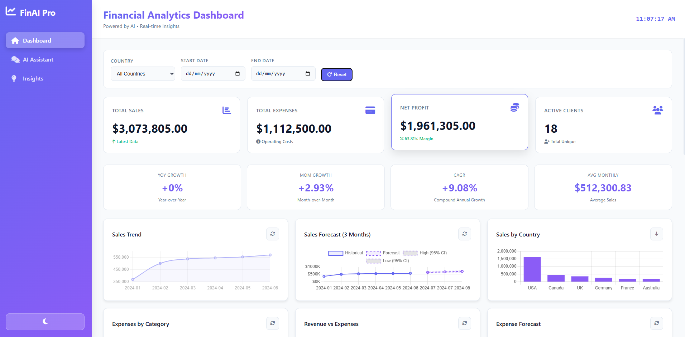
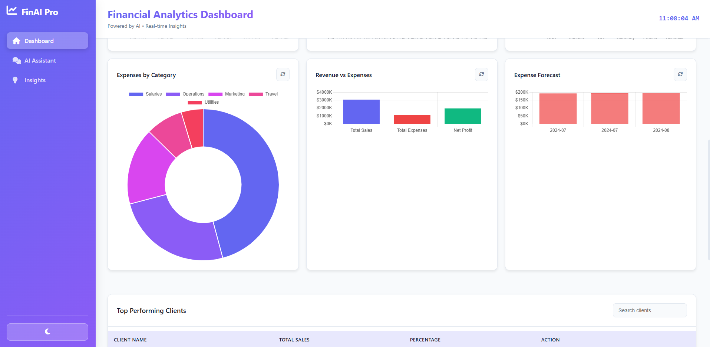
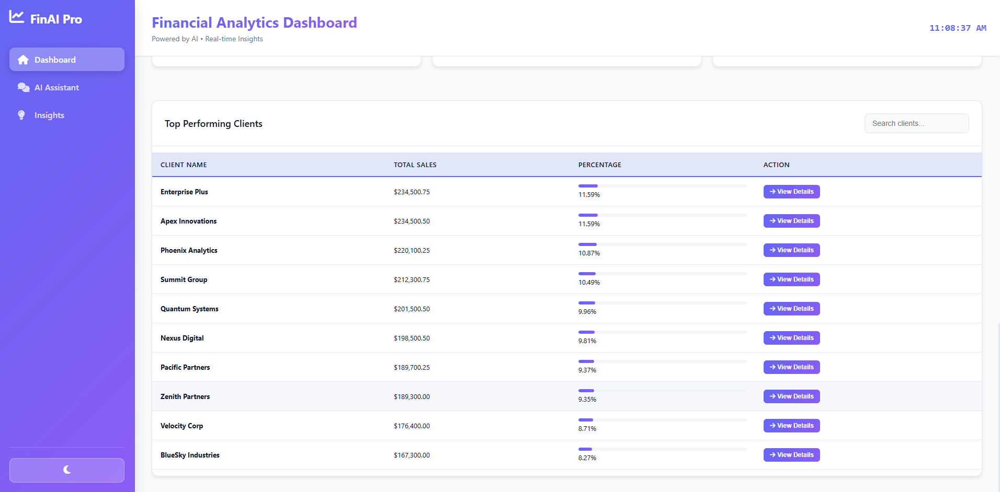
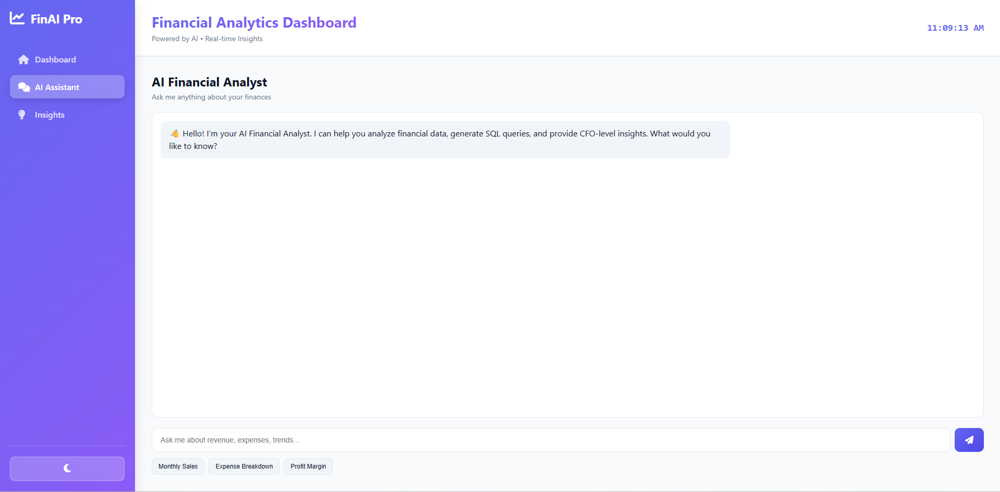
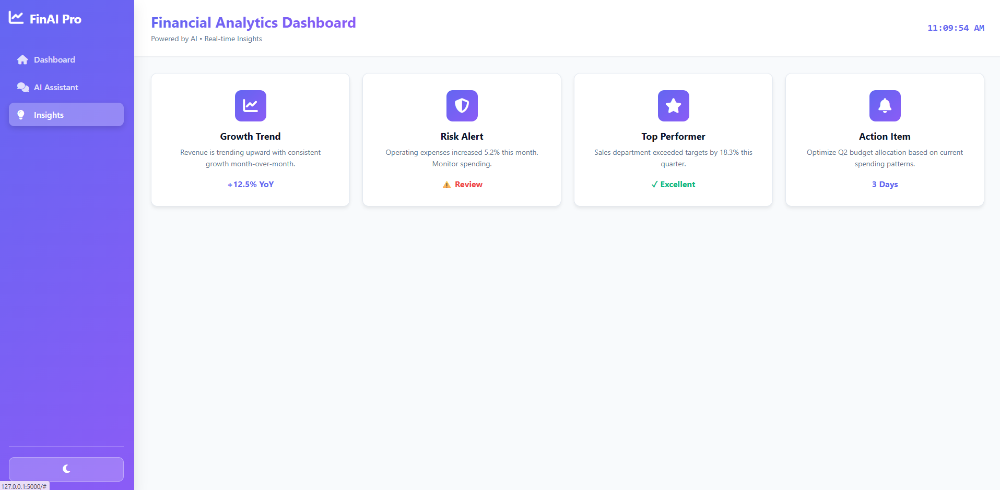

# AI Financial Analytics Platform

## Features
- Gemini-powered AI SQL generation
- Financial insights (CFO-level)
- MySQL integration
- Dashboard + AI chat

## Run
pip install -r requirements.txt
python app.py

## Setup
- Add your Gemini API key
- Update DB connection

## Use Cases
- Revenue analysis
- Cost breakdown
- Margin insights
- Financial trends

## 🎯 Demo

### Dashboard Overview

*Main dashboard with KPIs, charts, and growth metrics*

### Predictive Forecasting

*3-month sales forecast with 95% confidence intervals*

### Drill-Down Analysis

*Click any client to see transaction details*

### AI Assistant

*Ask financial questions in natural language*

### AI Insights

*Get summary insights/kpi on the sales data*
